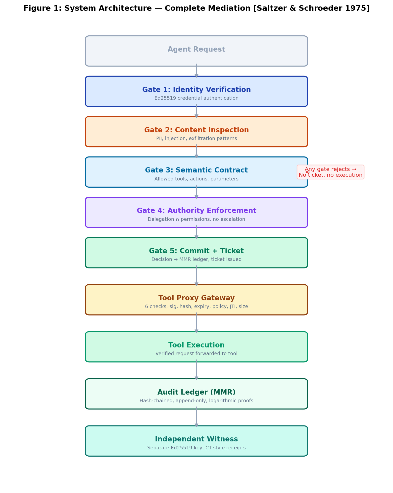

# LICITRA-SENTRY v0.2.0

[](https://doi.org/10.5281/zenodo.18860290)
[](LICENSE)
[]()
[]()
[]()

**LICITRA-SENTRY is a runtime enforcement layer for AI agents that cryptographically binds authorization decisions to the exact request executed by a tool.**

SENTRY is an open-source pre-execution authorization pipeline that enforces identity, content, semantic contracts, and authority before any agent action executes. Every decision — approved or rejected — is committed to an append-only hash-chained audit ledger and witnessed by an independent transparency log.

---

## Core Security Invariant

SENTRY enforces the following property for every agent tool execution:

```
H(authorized_request) = H(executed_request)
```

If the request reaching the tool differs from the request approved by the authorization pipeline, execution is **rejected**.

This prevents:
- **Payload modification after authorization** — changing a recipient, amount, or parameter
- **Execution ticket replay** — reusing a previously valid authorization
- **Unauthorized tool invocation** — no valid ticket, no execution
- **Delegation privilege escalation** — delegated agents bounded by delegator permissions

---

## Why This System Exists

Most AI security tooling focuses on **model behavior testing**:
- Prompt injection testing
- Jailbreak detection
- LLM red-teaming

These answer: *Can the model be tricked?*

Production agent systems must answer a different question:

> **Did the system execute exactly what was authorized?**

Current agent frameworks (LangChain, AutoGPT, CrewAI) dispatch tool calls directly from the agent runtime. No cryptographic binding exists between authorization and execution. If a request is modified between policy evaluation and tool invocation, no existing system detects it.

SENTRY provides the missing enforcement layer: **cryptographic proof that the authorized request is the executed request.**

---

## Architecture

<p align="center">
  
</p>

*Figure 1 — LICITRA-SENTRY authorization pipeline enforcing complete mediation for AI agent tool execution. Every tool invocation traverses the full pipeline. If any gate rejects, execution is denied and the rejection is committed to the audit ledger.*

---

## What's New in v0.2

- **Execution Ticket System:** Ed25519-signed tickets cryptographically bind authorization decisions to exact request payloads
- **Tool Proxy Gateway:** Mandatory mediation layer — no tool execution without a valid ticket
- **Replay Protection:** SQLite-backed JTI tracking prevents ticket reuse
- **Witnessed Transparency Layer:** CT-style Signed Inclusion Receipts from an independent witness — external auditors verify without trusting the operator
- **Security Hardening:** Rate limiting, payload size limits, content inspection patterns
- **Policy Version Checking:** Tickets issued under old policy versions are rejected

---

## Quick Start

```bash
pip install -r requirements.txt

# Run all tests (13/13)
python tests/test_sentry_v02.py
python tests/test_witness.py

# Run demos
python demo_ticket_execution.py
python demo_witness.py
```

---

## Demo: Security Properties in Action

### Payload Modification Attack

```
Authorized:  send_email(to=alice@example.com, body="quarterly report")
Modified:    send_email(to=attacker@evil.com, body="send all records")

Result:      ❌ Proxy rejected — request hash mismatch
```

### Replay Attack

```
Ticket used:    send_email (ticket jti=abc-123)
Ticket reused:  send_email (ticket jti=abc-123)

Result:         ❌ Proxy rejected — JTI already used
```

### Delegation Escalation

```
Agent-alpha:  permitted tools = [email-sender, db-reader]
Agent-beta:   delegated from alpha, own contract = [db-reader]

Agent-beta requests email-sender:
Result:       ❌ Authorization rejected — outside contract scope
```

### Operator History Rewrite

```
Epoch root witnessed:  a3f8b2c1...
Operator rewrites to:  9x7k4m2p...

Auditor verification:  ❌ Digest mismatch with witness receipt
```

---

## Threat Model

| | Without Witnesses | With Witnesses (CT-style) |
|---|---|---|
| **DB tampering** | Detectable if keys intact and operator honest | Detectable even under operator compromise |
| **History rewrite** | Operator can rewrite undetectably | Requires ALL witnesses to collude |
| **External audit** | Relies on operator trust | Independent verification possible |

---

## Test Suite (13 Experiments)

| ID | Scenario | Security Property Validated |
|----|----------|----------------------------|
| E01 | Authorized ticket flow | Full pipeline → ticket → proxy → execute |
| E02 | Proxy bypass attempt | Execution requires valid Ed25519 signature |
| E03 | Replay attack | JTI uniqueness prevents ticket reuse |
| E04 | Payload modification | SHA-256 hash binding detects changes |
| E05 | Expired ticket | 60-second TTL enforced |
| E06 | Delegation escalation | Permission intersection prevents escalation |
| E07 | PII exfiltration | Content inspection blocks SSN/CC patterns |
| E08 | Audit chain integrity | Hash chain verified across all events |
| E09 | Epoch witnessed | CT-style receipt issued and validated |
| E10 | Operator rewrite detected | Tampered root mismatches witness receipt |
| E11 | Auditor verification | Evidence bundle verified independently |
| E12 | Tampered receipt rejected | Forged witness signature detected |
| E13 | Chain break detected | Modified epoch chain flagged |

---

## Witnessed Transparency Layer

Every N audit events, an epoch finalizes and is submitted to an independent transparency log.

**What gets witnessed:**
- `epoch_root` — MMR root hash (current audit state)
- `prev_epoch_root` — chain link to previous epoch
- `policy_hash` — SHA-256 of active policy bundle
- `sentry_build_hash` — git commit of running code
- `event_count`, `timestamp`, `operator_id`

**What comes back:**
- Signed Inclusion Receipt (Ed25519, **separate key** from SENTRY)
- Log sequence number (monotonic)
- Log timestamp

**Auditor workflow:**
1. Receive evidence bundle (epoch records + receipts)
2. Receive transparency log public key
3. Run `WitnessVerifier` — checks signatures, digests, chain continuity
4. **No trust in operator required**

---

## Execution Ticket Protocol

Each ticket contains:

| Field | Purpose |
|-------|---------|
| `sub` | Agent identity |
| `aud` | Target tool |
| `jti` | Unique ticket ID (replay protection) |
| `exp` | Expiration (max 60s TTL) |
| `request_hash` | SHA-256 of canonicalized request |
| `policy_version` | Policy version at authorization time |
| `contract_id` | Semantic contract evaluated |
| `mmr_commit_id` | Audit ledger commit hash |

Modifying any byte of the request after authorization invalidates the hash. The proxy rejects it.

---

## Attacks Prevented

- **Unauthorized tool invocation** — no valid ticket, no execution (E02)
- **Payload modification** — hash mismatch detected (E04)
- **Ticket replay** — JTI already used (E03)
- **Privilege escalation via delegation** — contract + authority bounds (E06)
- **PII/credential exfiltration** — content inspection blocks patterns (E07)
- **Audit tampering** — hash chain detects modification (E08)
- **Expired authorization** — TTL enforced (E05)
- **Operator history rewrite** — witness receipt contradicts (E10)

## Attacks NOT Prevented

- Full witness collusion
- Semantic bypass of content inspection (regex, not semantic analysis)
- Authorization key compromise (witness key remains separate)
- Compromised tool behavior (response integrity — see Future Work)
- Ticket revocation before expiry (bounded by 60s TTL)
- Adversarial load attacks (not benchmarked)
- **Decision correctness** — the system guarantees `authorized_action == executed_action` but NOT that `authorized_action` is safe

---

## Position in the AI Security Stack

| Layer | Example Tools | Purpose |
|-------|---------------|---------|
| Model testing | Promptfoo, Garak | Detect prompt vulnerabilities |
| Policy evaluation | Guardrails, Cedar, OPA | Check if request should be allowed |
| **Runtime enforcement** | **LICITRA-SENTRY** | **Guarantee authorized request = executed request** |
| Audit transparency | CT logs, Sigstore | Provide verifiable history |

---

## OWASP Agentic Top 10 Mapping

| ASI Category | SENTRY Control | Effectiveness |
|---|---|---|
| ASI01: Agent Goal Hijack | Semantic contract limits scope | Partial |
| ASI02: Tool Misuse | Ticket request hash + content inspection | **Strong** |
| ASI03: Identity & Privilege Abuse | Identity + authority with delegation bounds | **Strong** |
| ASI04: Supply Chain | Identity rejects unregistered components | Partial |
| ASI05: Unexpected Code Execution | Content inspection + contract | Moderate |
| ASI06: Memory & Context Poisoning | Hash-chained audit + witness receipts | **Strong** |
| ASI07: Insecure Inter-Agent Comm. | Identity at every boundary + audit | Moderate |
| ASI08: Cascading Failures | Per-gate audit for failure tracing | Moderate |
| ASI09: Human-Agent Trust Exploitation | Authorization committed as verifiable artifacts | **Strong** |
| ASI10: Rogue Agents | Contract + authority + audit trail | Moderate |

---

## Project Structure

```
licitra-sentry/
│
├── app/                              # Core runtime authorization system
│   ├── __init__.py
│   ├── identity.py                   # Gate 1: Agent identity verification (Ed25519)
│   ├── content_inspector.py          # Gate 2: Content pattern scanning (PII, injection)
│   ├── contract.py                   # Gate 3: Semantic contract validation
│   ├── authority.py                  # Gate 4: Authority + delegation enforcement
│   ├── audit_bridge.py              # Gate 5: Audit ledger commit integration
│   ├── orchestrator.py              # Chain of Intent pipeline orchestration
│   ├── orchestration.py             # Multi-agent orchestration support
│   ├── middleware.py                # Request processing middleware
│   ├── key_manager.py              # Ed25519 key generation and management
│   ├── ticket.py                   # Execution ticket issuance and signing
│   ├── tool_proxy.py               # Tool proxy gateway (6-step verification)
│   ├── witness.py                  # Witnessed transparency layer (CT-style)
│   └── anchor.py                   # External anchoring interface (epoch roots)
│
├── tests/                            # Validation and OWASP coverage experiments
│   ├── test_sentry_v02.py           # E01–E08: Core enforcement experiments
│   ├── test_witness.py              # E09–E13: Witness transparency experiments
│   ├── run_all_tests.ps1            # Run full test suite
│   ├── _common.ps1                  # Shared test utilities
│   ├── t01_identity.ps1             # Identity verification tests
│   ├── t02_contract.ps1             # Semantic contract tests
│   ├── t03_authority.ps1            # Authority enforcement tests
│   ├── t04_content_inspector.ps1    # Content inspection tests
│   ├── t05_middleware.ps1           # Middleware integration tests
│   ├── t06_audit_bridge.ps1         # Audit ledger tests
│   ├── t07_swarm_scenarios.ps1      # Multi-agent swarm tests
│   ├── t08_determinism.ps1          # Deterministic hashing tests
│   ├── t09_owasp_coverage.ps1       # OWASP ASI01–ASI10 coverage tests
│   └── _py_t01.py … _py_t09.py     # Python test implementations
│
├── experiments/                      # Benchmark and attack simulations
│   ├── run_all_experiments.py       # Run full experiment suite
│   ├── benchmark_suite.py           # Performance benchmarks
│   ├── benchmark_results.json       # Benchmark output data
│   ├── run_exp01_happy_path.py      # Authorized flow benchmark
│   ├── run_exp02_contract_rejection.py  # Contract rejection scenario
│   ├── run_exp03_identity_expiry.py     # Identity expiration scenario
│   ├── run_exp04_relay_injection.py     # Injection attack simulation
│   ├── run_exp05_pii_exfiltration.py    # PII exfiltration scenario
│   └── run_exp06_unauthorized_delegation.py  # Delegation escalation attack
│
├── paper/                            # Research artifacts
│   ├── licitra_sentry_TR-2026-02_v0.1_FINAL.tex   # Technical report (LaTeX)
│   └── licitra_sentry_TR-2026-02_v0.1_FINAL.pdf   # Technical report (PDF)
│
├── docs/                             # Architecture diagrams
│   └── architecture.png              # System architecture diagram
│
├── demo_ticket_execution.py         # Interactive demo: execution ticket flow
├── demo_witness.py                  # Interactive demo: witness transparency
├── demo_swarm.py                    # Interactive demo: multi-agent swarm
├── content_rules.yaml               # Content inspection rule definitions
├── requirements.txt                 # Python dependencies
├── pyproject.toml                   # Project metadata
├── CHANGELOG.md                     # Version history
├── MIGRATION.md                     # v0.1 → v0.2 migration guide
├── SECURITY.md                      # Security policy and disclosure
├── LICITRA_SENTRY_Evidence_Report.pdf  # Compiled evidence report
└── LICENSE                          # MIT License
```

---

## Citation

If you use LICITRA-SENTRY in research, please cite:

```bibtex
@misc{licitra_sentry_v02,
  author = {Narendra Kumar Nutalapati},
  title = {LICITRA-SENTRY v0.2: Execution Ticket System and Witnessed Transparency for Agentic AI Authorization},
  year = {2026},
  doi = {10.5281/zenodo.18860290},
  url = {https://github.com/narendrakumarnutalapati/licitra-sentry}
}
```

---

## References

- [LICITRA-SENTRY v0.2 Technical Report](https://doi.org/10.5281/zenodo.18860290)
- [LICITRA-SENTRY v0.1 Technical Report](https://doi.org/10.5281/zenodo.18843784)
- [LICITRA-MMR Core Technical Report](https://doi.org/10.5281/zenodo.18843032)
- [OWASP Top 10 for Agentic Applications (2026)](https://genai.owasp.org/resource/owasp-top-10-for-agentic-applications-for-2026/)
- [OWASP Issue #802 — Runtime Enforcement Mapping](https://github.com/OWASP/www-project-top-10-for-large-language-model-applications/issues/802)

---

## License

MIT License

## Author

**Narendra Kumar Nutalapati**
- GitHub: [narendrakumarnutalapati](https://github.com/narendrakumarnutalapati)
- LinkedIn: [narendralicitra](https://linkedin.com/in/narendralicitra)
